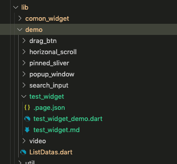
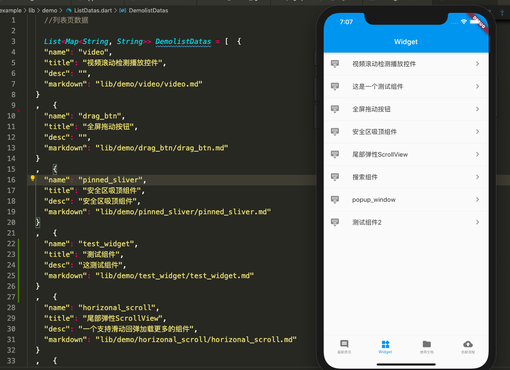
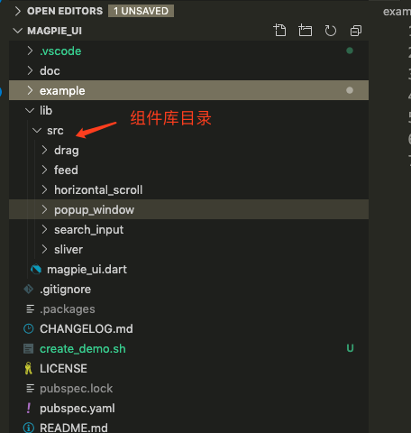

[toc]

# 怎么样快速的接入组件

## 安装
Mac下安装dart：
```
brew tap dart-lang/dart
brew install dart
```

## 进入magpie_ui工程目录，运行脚本：
```
sh create_demo.sh
```

-------
根据提示依次输入Demo名称、组件名称和组件描述，回车运行脚本。
运行脚本主要做两件事：
1. 在example/lib/demo中生成对应组件的文件夹。如图：


文件夹test_widget中自动生成如图所示的三个文件:
`.page.json格式：`

``` 
{
    "name": "demo名称",
    "title": "组件名称",
    "desc": "组件描述",
    "markdown": "lib/demo/test_widget/test_widget.md" 
  }
```
markdown是字段，是用来记录对应的组件的md文件的位置，作用是给点击list之后跳到相应的详情页。

`.md文件`
对应的组件的markdown，用于组件详情页的展示，
可以在markdown中插入想要展示的demo样式。格式如下：

```
{{"demo": "lib/demo/horizonal_scroll/HorizontalScrollDefault.dart", "code": true, "jump":true}}
```
参数详解：
* demo：需要引入的样式的路径
* code：在样式下面是否显示代码
* jump：该样式是否需要跳转界面显示（如果效果是全屏的效果，最好跳到下一页显示）

`.dart文件`
markdown中需要引入的样式的实现文件

2. 自动在ListDatas中加入需要在list中显示的组件。



## 配置pubspec.yaml
因为需要读取.md和.dart文件，所以需要配置assets，如:
```
- lib/demo/test_wdiget/
```

## 配置demo
需要在util/config.dart中配置自己的demo数据：
* key: markdown中配置的'demo'的value
* value: 返回对应的demo的实例对象，用于在详情页中展现

如markdown中配置了
`{{"demo": "lib/demo/test_widget/test_widget", "code": true, "jump":true}}`

则需要在config.dart中配置：
`'lib/demo/test_widget/test_widget': () => TestWidget(),`

至此就完成了一个简单的接入工作，运行工程，会在列表页看见加入的demo。

## 加入自己的组件进行显示
将自己的组件放入外层的lib/src文件夹中，然后在自己的demo中引用自己的组件就可以啦。
